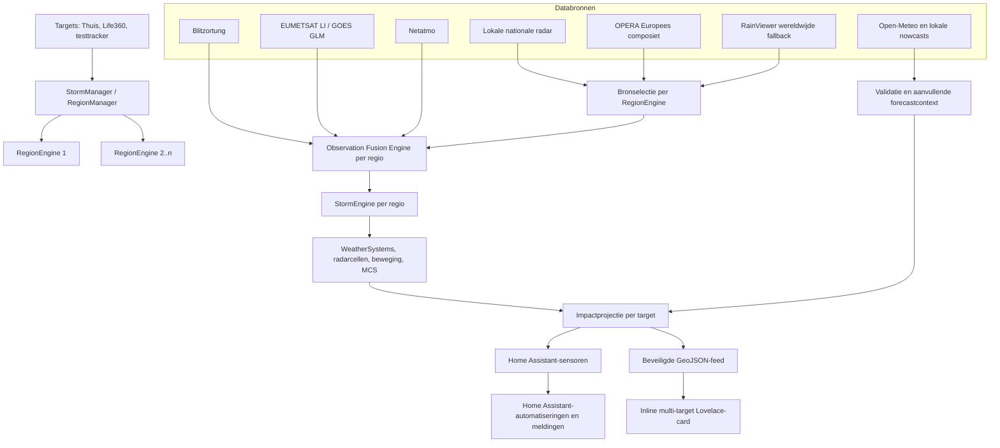

# Storm Tracker V3 — technisch totaaloverzicht

**Versie:** 0.4.59  
**Datum:** 20 juli 2026  
**Platform:** Home Assistant custom integration  
**Repository:** https://github.com/druptown/Storm-Tracker  
**Status:** actief ontwikkelproject; niet gebruiken als enige bron voor veiligheidskritische beslissingen

## 1. Doel van het systeem

Storm Tracker V3 is een geografisch dynamisch systeem voor het volgen van neerslag en onweer rond meerdere personen of plaatsen. De hoofdfocus ligt op actuele neerslag, de beweging van neerslagsystemen en de verwachte impact op individuele locaties. Bliksem, luchtdruk, grondmetingen en modelverwachtingen dienen als aanvullende informatie.

Het systeem volgt gelijktijdig:

1. de vaste thuislocatie van Home Assistant;
2. geselecteerde Life360-`device_tracker`-entiteiten;
3. een optionele fictieve tracker voor ontwikkeling en tests.

Voor ieder target probeert het systeem te bepalen:

- of er relevante neerslag aanwezig is;
- welk WeatherSystem operationeel het belangrijkst is;
- hoe ver de dichtstbijzijnde echte neerslagfootprint ligt;
- of het systeem nadert, lateraal passeert of wegtrekt;
- wanneer de dichtste passage wordt verwacht;
- hoe dicht het systeem vermoedelijk zal passeren;
- of de baan het target raakt, langs de rand passeert of mist;
- welke intensiteit bij passage waarschijnlijk is;
- hoe betrouwbaar die verwachting is;
- welke radar- en aanvullende bronnen voor die locatie actief zijn.

## 2. Architectuur in één schema



Het fundamentele ontwerpprincipe is dat bronnen observaties produceren, engines daar meteorologische systemen van maken en targetprojectie pas daarna bepaalt wat een systeem voor een specifieke persoon betekent.

## 3. Targets

### 3.1 Thuis

Thuis is altijd aanwezig. De coördinaten komen uit de Home Assistant-configuratie en worden gekoppeld aan `zone.home`. De thuislocatie is het primaire target en krijgt ook de legacy-hoofdsensoren.

### 3.2 Life360-personen

Personen worden in de configuratie-UI geselecteerd als Life360-`device_tracker`-entiteiten. Bij iedere locatie-update worden latitude en longitude opnieuw gelezen. De targetinformatie wordt vervolgens bijgewerkt en eventueel aan een andere RegionEngine gekoppeld.

### 3.3 Fictieve tracker

Een willekeurige `device_tracker` kan als testtracker worden ingesteld. Deze is bedoeld om zonder fysieke verplaatsing de volgende situaties te testen:

- een nieuwe engine op grote afstand;
- lokale providers in een ander land;
- GOES rond de Amerika's;
- DPC in Italië;
- AEMET in Spanje;
- provider sleep/wake/cooldown;
- kaartcentrering en targetprojectie.

### 3.4 Plaats- en landbepaling

De integratie leest bij het opstarten:

```text
/homeassistant/www/places.json
```

Deze lokale database wordt gebruikt om coördinaten om te zetten naar:

- plaatsnaam;
- adres of gebiedsaanduiding indien beschikbaar;
- ISO-landcode;
- geschatte afstand tot de gevonden plaats.

Dit vermijdt een externe reverse-geocodingaanvraag bij iedere trackerupdate. De gevonden landcode beïnvloedt de radarbronkeuze.

## 4. Dynamische RegionEngines

### 4.1 Waarom RegionEngines bestaan

Een wereldwijde provider voor iedere persoon permanent pollen zou inefficiënt zijn. Daarom groepeert `StormManager` targets in regionale runtimecontexten.

Iedere RegionEngine bezit:

- een geografisch centrum;
- een configureerbare observatieradius;
- een set gekoppelde targets;
- één Observation Fusion Engine;
- één StormEngine;
- eigen WeatherSystems;
- eigen bronselectie en diagnostiek;
- eigen persistente MCS-historiek.

### 4.2 Sharing distance

Targets kunnen dezelfde engine delen wanneer ze binnen de ingestelde `engine_sharing_distance_km` vallen. De standaardwaarde is 150 km. De dichtstbijzijnde deelbare engine wordt gekozen.

Voorbeeld:

```text
Thuis Brussel + persoon Antwerpen → één gedeelde RegionEngine
Persoon Ardennen → mogelijk tweede RegionEngine
Testtracker Madrid → aparte Spaanse RegionEngine
```

### 4.3 Observatieradius

De observatieradius is onafhankelijk van de sharing distance. De standaard in de config flow is 300 km en kan tussen 50 en 1000 km worden ingesteld.

- Sharing distance bepaalt welke targets rekenwerk delen.
- Observatieradius bepaalt welke meteorologische observaties een engine aanvaardt.

### 4.4 Verplaatsen en opruimen

Wanneer een target verplaatst:

1. wordt gecontroleerd of de huidige engine nog deelbaar is;
2. zo niet, wordt naar een geschikte bestaande engine gezocht;
3. zo nodig wordt een nieuwe engine gemaakt;
4. het target wordt uit de oude engine verwijderd;
5. een lege engine wordt beëindigd;
6. systemen buiten het nieuwe monitoringsgebied worden verwijderd;
7. locatiegebonden providers worden opnieuw gereconcilieerd.

## 5. Provider-lifecycle

De lifecyclecontroller activeert nationale en lokale providers uitsluitend wanneer minstens één actieve engine hun geografische dekking raakt.

Statussen:

| Status | Betekenis |
|---|---|
| `sleeping` | Geen relevante engine; provider doet niets |
| `initializing` | Provider wordt gestart |
| `active` | Provider mag periodiek pollen |
| `cooldown` | Dekking niet meer nodig, maar korte terugkeer blijft mogelijk |
| `stale` | Data is te oud |
| `rate_limited` | Upstream begrenst aanvragen |
| `error` | Starten of pollen mislukte |

De cooldown bedraagt momenteel vijf minuten. Daarna wordt een provider zonder relevante engine gestopt. Diagnostiek omvat onder meer status, aantal overeenkomende engines, laatste poll, aantal observaties en foutklasse.

## 6. Radarbronselectie per RegionEngine

Sinds v0.4.59 bestaat niet langer één globale radarbron voor alle locaties. Iedere RegionEngine krijgt een eigen beslissing.

### 6.1 Selectie-algoritme

Voor iedere engine:

1. verzamel de landcodes van alle gekoppelde targets;
2. bepaal de bijbehorende lokale officiële radar;
3. controleer of die bron geconfigureerd, actief, foutvrij en recent is;
4. gebruik de lokale radar wanneer gezond;
5. val terug op OPERA wanneer de lokale bron ontbreekt of ongezond is;
6. val terug op RainViewer wanneer OPERA niet beschikbaar is;
7. publiceer `None`/onvoldoende data wanneer ook RainViewer niet gezond is.

Wanneer één gedeelde engine meerdere verschillende nationale radargebieden overspant, krijgt OPERA voorkeur. Een composiet voorkomt dan abrupte naden en dubbele systemen.

Per engine wordt gepubliceerd:

- geselecteerde bron;
- reden;
- betrokken landcodes;
- leeftijd sinds laatste succesvolle bronupdate.

### 6.2 Actuele landenmatrix

| Land | Primaire bron | Fallback 1 | Fallback 2 | Opmerking |
|---|---|---|---|---|
| België | KMI | OPERA | RainViewer | KMI ook onafhankelijke OPERA-validatie |
| Nederland | KNMI | OPERA | RainViewer | KNMI WMS/nowcast |
| Duitsland | DWD RADOLAN | OPERA | RainViewer | Officiële Duitse radar |
| Frankrijk | Météo-France | OPERA | RainViewer | Token vereist |
| Groot-Brittannië | Met Office | OPERA | RainViewer | Slapende nationale provider |
| Italië | DPC Protezione Civile SRI | OPERA | RainViewer | Actuele 1 km GeoTIFF |
| Continentaal Spanje | AEMET | OPERA | RainViewer | Publieke GeoTIFF-bundel, geen API-key nodig |
| Luxemburg | OPERA | naburige nationale bronnen | RainViewer | MeteoLux levert aanvullende nowcast |
| Oostenrijk | OPERA | RainViewer | — | GeoSphere INCA is aanvullende nowcast |
| Andere regio's | werkelijk geïmplementeerde bron indien beschikbaar | RainViewer | — | Bronmatrix bevat ook geplande providers |

## 7. Radarproviders in detail

### 7.1 KMI

KMI levert Belgische radarframes via de KMI-appservice. De provider:

- haalt forecast-/animatiemetadata op;
- kiest het nieuwste niet-toekomstige frame;
- downloadt het beeld;
- bemonstert pixels;
- vertaalt KMI-kleuren naar intensiteit 1–8;
- zet pixels om naar latitude/longitude;
- weigert transparante of niet-radarkleurige pixels.

Zwakke kleurklassen worden voorzichtig behandeld omdat de achtergrondkaart zelf groene tinten bevat.

### 7.2 KNMI

De KNMI-provider gebruikt WMS-radar. Ze produceert actuele observaties en nowcastframes. Uit de forecast worden onder meer intensiteitsniveaus voor ongeveer +30, +60 en +120 minuten gepubliceerd. De huidige YAML-route ondersteunt KNMI API/WMS-sleutels.

### 7.3 DWD RADOLAN

DWD RADOLAN is de officiële Duitse lokale radarbron. Regenwaarden worden naar de uniforme intensiteitsschaal vertaald. De provider wordt alleen actief wanneer een engine het Duitse dekkingsgebied raakt.

### 7.4 Météo-France

De Franse provider verwerkt officiële radarproducten en wordt alleen geregistreerd wanneer een Météo-France-token aanwezig is. Zonder token kiest een Franse engine OPERA. De provider wordt bovendien als onafhankelijke referentie voor OPERA-filtering gebruikt.

### 7.5 Met Office

De Britse provider selecteert de nieuwste beschikbare officiële HDF-radarfile. Ze slaapt buiten het Britse dekkingsgebied. Bij fouten of lege/onbruikbare output blijft OPERA de veilige fallback.

### 7.6 DPC Protezione Civile — Italië

De DPC-provider gebruikt het SRI-product, Surface Rainfall Intensity:

- endpoint voor het nieuwste product;
- tijdelijke officiële download-URL;
- GeoTIFF van ongeveer 1200 × 1400 pixels;
- nominale rasterresolutie 1 km;
- waarden rechtstreeks in mm/u;
- updatecyclus ongeveer vijf minuten;
- officiële Lambert Conformal Conic-projectie;
- omzetting naar EPSG:4326 met `pyproj`;
- frames ouder dan twintig minuten worden geweigerd;
- veiligheidslimiet van 25 MiB;
- bemonsteringsstride 4, dus operationele observatieblokken van circa 4 × 4 km.

Alleen pixels met minimaal 0,1 mm/u en minder dan 500 mm/u worden aanvaard. NoData-waarden zoals -9999 verdwijnen hierdoor automatisch.

### 7.7 AEMET — Spanje

De AEMET-provider gebruikt het publieke endpoint:

```text
https://www.aemet.es/es/api-eltiempo/radar/download/compo
```

Dit endpoint vereist voor deze composietdownload geen API-key. Het levert:

- een kleine `tar.gz`;
- 24 recente frames;
- bestandsnamen met UTC-tijd;
- GeoTIFF in EPSG:4326;
- rastergrootte ongeveer 692 × 497;
- intensiteitsklassen 0–7.

De parser:

- aanvaardt alleen exact verwachte bestandsnamen;
- selecteert het nieuwste frame;
- extraheert alleen dat ene lid in geheugen;
- blokkeert te grote archieven en frames;
- leest tiepoint en pixelschaal uit GeoTIFF-tags;
- bemonstert met stride 2;
- vertaalt rasterposities rechtstreeks naar WGS84-coördinaten;
- weigert frames ouder dan 25 minuten.

De huidige composiet omvat continentaal Spanje. De Canarische Eilanden vallen niet binnen dit raster en gebruiken een fallback.

### 7.8 OPERA

OPERA is het Europese composiet en de belangrijkste regionale fallback. Omdat composieten clutter, lage kwaliteitsindices en anomalieën kunnen bevatten, worden cellen niet blind aanvaard.

OPERA-filtering gebruikt:

- productleeftijd;
- quality index;
- gemiddelde dBZ;
- maximale dBZ;
- oppervlakte;
- structuur van de echo;
- footprintpunten;
- bevestiging door onafhankelijke radars binnen ongeveer 12 km;
- maximaal tijdsverschil van vijftien minuten.

Een OPERA-cel wordt aanvaard als:

1. de quality index voldoende hoog is; of
2. de echo zelfstandig meteorologisch overtuigend is — ongeveer gemiddelde ≥20 dBZ, maximum ≥30 dBZ en oppervlakte ≥50 km² — en de benodigde structuur heeft; of
3. een onafhankelijke bron nabijgelegen recente neerslag bevestigt.

Bij lage kwaliteit wordt alleen het werkelijk bevestigde deel van een grote footprint behouden. Eén echte lokale bui kan daardoor geen foutieve megacel volledig legitimeren.

### 7.9 RainViewer

RainViewer is de wereldwijde operationele fallback. De provider:

- haalt het manifest op;
- kiest het nieuwste radarframe;
- bewaakt freshness en health;
- downloadt de benodigde kaarttegels;
- gebruikt een uniforme kleurenschaal;
- zet natte pixels om naar observaties;
- begrenst de output tot het actieve observatiegebied.

RainViewer blijft qua voorkeur onder lokale officiële radar en OPERA.

## 8. Passieve radar-autokalibratie

De autokalibratielaag vergelijkt operationele radar met onafhankelijke referentiebeelden, momenteel vooral KMI en RainViewer. Ze verzamelt:

- frameparen;
- overeenkomstige natte gebieden;
- gemiste echo's;
- vermoedelijke valse echo's;
- overeenkomstscore;
- bronbeschikbaarheid;
- tijdsverschil tussen frames.

Historische framevergelijking moet altijd dezelfde of vrijwel dezelfde waarnemingstijd gebruiken. Het systeem is momenteel conservatief: het verzamelt en publiceert bewijs, maar laat drempels niet onbeperkt autonoom verschuiven.

## 9. Bliksembronnen

### 9.1 Blitzortung

Blitzortung is primair. Het is een realtime pushverbinding. Iedere inslag wordt tegen alle actieve RegionEngines getest en naar iedere relevante engine gerouteerd. De bron hoeft dus niet per target afzonderlijk verbonden te worden.

### 9.2 EUMETSAT Lightning Imager

Wanneer EUMETSAT consumer key en secret geconfigureerd zijn, kan LI als Blitzortung-fallback werken. De integratie haalt tijdelijk OAuth-tokenmateriaal op en zoekt recente producten. Pollfrequentie is twee minuten.

EUMETSAT LI meet bliksem en mag nooit als neerslagradar worden behandeld.

### 9.3 NOAA GOES GLM

GOES-18 en GOES-19 GLM leveren bliksemdekking voor de Amerika's. De benodigde satelliet wordt op basis van longitude en regionale dekking gekozen. Pollfrequentie is één minuut wanneer de satellietfallback nodig is.

### 9.4 Selectiemodi

`lightning_source_mode`:

- `auto`: Blitzortung primair; satelliet wanneer Blitzortung niet verbonden is;
- `satellite_test`: Blitzortungobservaties worden bewust genegeerd zodat EUMETSAT/GOES getest kunnen worden.

## 10. Grondmetingen en aanvullende bronnen

### 10.1 Netatmo

Netatmo levert openbare stationobservaties binnen de ingestelde radius:

- live regen;
- regen over vijf minuten;
- wind en richting;
- windstoten;
- luchtdruk;
- temperatuur;
- luchtvochtigheid.

Netatmo-observaties mogen nooit zelfstandig een WeatherSystem maken. Ze kunnen een bestaand systeem bevestigen en de betrouwbaarheid aanpassen.

### 10.2 Luchtdruktrend

De `PressureTrendTracker` bewaart stationhistorie persistent en vergelijkt dezelfde stations over tijd. Uitvoer:

- regionale mediane druk;
- drukverandering over 15, 30 en 60 minuten;
- aantal actuele drukstations;
- aantal stations dat per tijdvenster vergelijkbaar is;
- trendclassificatie;
- indicatie van snelle drukval.

Na een HA-herstart wordt bruikbare historie hersteld.

### 10.3 Open-Meteo

Open-Meteo biedt aanvullende forecastcontext. Deze bron is niet de primaire actuele radar, maar helpt bij langere verwachting en plausibiliteitscontrole.

### 10.4 MeteoLux

MeteoLux is een lokale Luxemburgse nowcast-/validatieprovider. Ze wordt via de lifecycle alleen actief bij relevante dekking.

### 10.5 GeoSphere Austria

GeoSphere INCA levert Oostenrijkse nowcastinformatie. Het systeem vat onder andere regen in forecaststappen samen. OPERA blijft momenteel de operationele Oostenrijkse radarbron.

### 10.6 ItaliaMeteo/Open-Meteo ARPAE

ItaliaMeteo levert modelverwachting voor Italië. De eerder gevonden dagelijkse DPC-radarbundels waren niet actueel genoeg voor operationele realtime tracking. Daarom is de nieuwe directe DPC SRI-provider de primaire radar en blijft ItaliaMeteo forecastvalidatie.

## 11. NWC SAF en satellietneerslag

NWC SAF is nog niet operationeel geïntegreerd als neerslagfallback. NWC SAF is hoofdzakelijk een software- en productketen waarvoor registratie, productselectie en lokale verwerking nodig kunnen zijn; het is geen eenvoudig publiek realtime JSON-endpoint.

De beoogde toekomstige keten is:

```text
lokale radar → OPERA → geschikt satelliet-neerslagproduct → RainViewer
```

De actuele productieketen is:

```text
lokale radar → OPERA → RainViewer
```

Een toekomstige satellietbron moet werkelijk neerslag of convectieve wolkenproducten leveren. Lightning Imager-data mag niet als neerslagfallback worden misbruikt.

## 12. Uniform Observation-model

Alle bronnen worden omgezet naar `Observation`.

Typen:

| Type | Gebruik |
|---|---|
| `LIGHTNING` | Puntinslag met tijd en positie |
| `RADAR` | Neerslagpixel, cel of footprint |
| `RAIN` | Grondverificatie door station |

Mogelijke velden:

- `lat`, `lon`, `timestamp`;
- `intensity` op uniforme schaal;
- `max_dbz`, `mean_dbz`;
- `area_km2`, `quality`;
- compacte `footprint_points`;
- `radar_cell_id`;
- `parent_system_id` en parent-footprint;
- `rain_mm`, `rain_5min`, `station_id`;
- wind, windhoek en windstoot;
- luchtdruk, temperatuur en vochtigheid;
- `source`.

Providers maken geen voorspelling voor personen. Ze leveren alleen observaties.

## 13. Observation Fusion Engine

Iedere RegionEngine heeft één OFE. Taken:

1. observaties ontvangen;
2. dedupliceren per type en bronpositie;
3. RAIN-observaties per station dedupliceren;
4. maximaal één uur buffer bewaren;
5. observaties gedurende één seconde batchen;
6. batches naar de regionale StormEngine sturen.

Observaties van verschillende typen op dezelfde plaats zijn geen duplicaten. Een blikseminslag en een regenstation mogen dus naast elkaar bestaan.

## 14. StormEngine en WeatherSystems

### 14.1 Verwerkingsvolgorde

Per batch:

1. LIGHTNING wordt aan een bestaand systeem gekoppeld of maakt een nieuw systeem;
2. RADAR wordt gekoppeld of maakt een nieuw systeem;
3. RAIN verifieert uitsluitend bestaande systemen;
4. radarcellen worden opgeschoond en geclassificeerd;
5. centroid, beweging en geometrie worden bijgewerkt;
6. nabije systemen worden eventueel samengevoegd;
7. oude systemen worden sluimerend of verwijderd;
8. HA-events en persistente opslag worden bijgewerkt.

### 14.2 Belangrijke drempels

| Parameter | Waarde |
|---|---:|
| Clusterradius | 30 km |
| Mergeafstand | 60 km |
| Merge-throttle | 15 s |
| Sluimerend na | 5 min |
| Verwijderen na | 15 min |
| Maximum actieve systemen | 15 per engine |
| Minimum bewegingspunten | 4 |
| Maximum historiepunten | 20 |
| Maximum ouderdom bewegingshistorie | 60 min |
| Hullvenster | 15 min |

### 14.3 Radarcellen en parent-systemen

Een groot neerslaggebied kan uit meerdere lokale cellen bestaan. De engine bewaart daarom:

- lokale RadarCell-snapshots;
- maximale intensiteit;
- lokale footprint;
- een parent-system-ID;
- totale parent-oppervlakte en footprint.

Dat voorkomt dat een lange regenband alleen als één onnauwkeurige centroidstip wordt weergegeven.

### 14.4 Beweging

De engine bewaart centroidhistorie en berekent via regressie:

- heading in graden;
- snelheid in km/u;
- duur van de bewegingshistorie;
- aantal meetpunten;
- fitkwaliteit;
- confidence `Laag`, `Matig` of `Hoog`;
- trackingstatus.

Een vector wordt op kaart en in prognoses alleen operationeel gebruikt wanneer:

- heading en snelheid bestaan;
- snelheid positief is;
- tracking bevestigd is;
- confidence Matig of Hoog is;
- minstens vier bewegingspunten bestaan;
- minstens tien minuten historie beschikbaar is;
- fitkwaliteit minstens 0,60 is.

## 15. MCS-detectie

MCS staat voor Mesoscale Convective System. De classificatie kijkt naar:

- duur van het systeem;
- totale neerslagspan;
- convectieve span;
- aantal convectieve cellen;
- aantal intense cellen;
- parent-oppervlakte;
- continuïteit over opeenvolgende radarframes.

Statussen:

- `not_evaluated`;
- `not_mcs`;
- `candidate`;
- `confirmed`.

MCS-historie wordt per geografische enginesleutel opgeslagen zodat een HA-herstart niet alle continuïteit wist.

## 16. Targetprojectie en statusselectie

Voor ieder target worden alleen systemen uit de toegewezen RegionEngine onderzocht. De afstand wordt bij voorkeur tot het dichtstbijzijnde echte radarfootprintpunt berekend; alleen zonder footprint wordt de centroidafstand gebruikt.

### 16.1 Rangschikking bij meerdere systemen

De operationeel belangrijkste bui wint, niet noodzakelijk de dichtstbijzijnde centroid:

1. actuele neerslag binnen circa 5 km;
2. bevestigde voorspelde rake passage binnen 90 minuten;
3. voorspelde randpassage;
4. ander naderend systeem;
5. lateraal systeem;
6. wegtrekkend systeem;
7. bevestigd systeem zonder bruikbare projectie;
8. alleen waargenomen systeem.

`selected_reason` verklaart de keuze, bijvoorbeeld `current_precipitation`, `forecast_hit`, `forecast_edge`, `approaching`, `lateral` of `moving_away`.

### 16.2 Statussen

| Status | Betekenis |
|---|---|
| `droog` | Geen actief relevant systeem |
| `waargenomen` | Systeem gezien maar onvoldoende betrouwbare tracking |
| `bevestigd` | Systeem bevestigd, zonder duidelijke naderingscategorie |
| `naderend` | Naderingssnelheid >1 km/u |
| `langs_trekkend` | Naderingssnelheid ongeveer tussen -1 en +1 km/u |
| `wegtrekkend` | Naderingssnelheid <-1 km/u |
| `onvoldoende_data` | Target niet beschikbaar of geen radardekking |

### 16.3 Passageberekening

De beweging wordt ontbonden ten opzichte van het target. Het systeem berekent:

- bearing naar het target;
- naderingssnelheid;
- gewone ETA bij rechtstreekse nadering;
- tijd tot dichtste passage;
- afstand van de centroidbaan bij dichtste passage;
- afstand van de systeemfootprint bij passage;
- onzekerheidsmarge op basis van fit en confidence.

Classificatie:

- `raak`: footprint wordt verwacht over het target;
- `rand`: passage valt binnen de onzekerheidsmarge;
- `mist`: systeem passeert buiten footprint en onzekerheidsmarge.

## 17. Korte-termijnverwachting

Een forecast wordt alleen gepubliceerd wanneer:

- tracking bevestigd is;
- confidence Matig of Hoog is;
- dichtste passage tussen nu en 90 minuten ligt;
- passageclassificatie beschikbaar is;
- radarcellen bruikbare dBZ bevatten.

De intensiteitstrend wordt uit het vroegste en nieuwste beschikbare radarframe bepaald. Extrapolatie naar passage wordt beperkt tot maximaal ±10 dBZ en de uitkomst tot 0–75 dBZ.

Zekerheid:

- basis 82% bij Hoge confidence;
- basis 64% bij Matige confidence;
- bonus voor extra opeenvolgende radarframes;
- straf naarmate de horizon dichter bij 90 minuten ligt;
- totale begrenzing 25–95%.

Uitvoer:

- `forecast_available`;
- `expected_passage_at`;
- `forecast_horizon_minutes`;
- `forecast_confidence_percent`;
- `forecast_intensity_dbz`;
- `forecast_intensity_label`;
- `intensity_trend_dbz_per_hour`.

Intensiteitslabels:

| dBZ | Label |
|---:|---|
| <20 | zeer licht |
| 20–29,9 | licht |
| 30–39,9 | matig |
| 40–49,9 | zwaar |
| ≥50 | zeer zwaar |

## 18. Pollfrequenties

| Proces | Interval |
|---|---:|
| Operationele radarselectie en OPERA/RainViewer | 5 min |
| KMI/KNMI radarvergelijking | 5 min |
| Nationale lifecycleproviders | 5 min |
| Netatmo | 5 min |
| Open-Meteo | 10 min |
| EUMETSAT LI | 2 min |
| GOES GLM | 1 min |
| Blitzortung | realtime push |
| OFE-batching | 1 s |

Nieuwe nationale data kan bij een nieuwe providerpoll onmiddellijk naar de geselecteerde engine worden gerouteerd.

## 19. Home Assistant-sensoroutputs

### 19.1 Operationele outputs

| Sensornaam | Functie |
|---|---|
| STV3 Neerslagstatus | Hoofdstatus met targetimpact |
| STV3 `<target>` Neerslagstatus | Volledige impactberekening per persoon/testtracker |
| STV3 Actieve Storms | Aantal en compacte lijst WeatherSystems |
| STV3 Dichtstbijzijnde Storm | Afstand en uitgebreide details |
| STV3 MCS Detectie | Kandidaten en bevestigde MCS'en |
| STV3 Region Engines | Engines, centra, targets, systemen en bronkeuze |
| STV3 Actieve Radarbron | Globale aanduiding of `per_engine`, met volledige enginematrix |
| STV3 Kaart GeoJSON | Compact aantal features en volledige feed als attributen |

Per-target neerslagstatus bevat onder andere:

- target-ID en naam;
- locatie-entiteit;
- coördinaten;
- plaats, adres, landcode en locatienauwkeurigheid;
- engine-ID en radardekking;
- gekozen storm en selectiereden;
- status;
- afstand en impactpunt;
- systeemcentrum en type;
- maximale dBZ;
- heading, snelheid en naderingssnelheid;
- ETA;
- dichtste passage, tijd en onzekerheid;
- passageclassificatie;
- trackingconfidence;
- forecasttijd, intensiteit en zekerheid;
- regionale luchtdruktrend.

### 19.2 Bronsensoren en diagnostiek

- STV3 Blitzortung Inslagen;
- STV3 Blitzortung Laatste Inslag;
- STV3 OPERA Observaties;
- STV3 KMI Observaties;
- STV3 KMI Intensiteit;
- STV3 RainViewer Observaties;
- STV3 KNMI Intensiteit Nu;
- STV3 KNMI Nowcast;
- STV3 Netatmo Stations;
- STV3 Netatmo Regen Stations;
- STV3 Netatmo Luchtdruktrend;
- STV3 Provider Lifecycle;
- STV3 Radar Autokalibratie;
- STV3 Open-Meteo Gear;
- STV3 Fictieve Tracker.

Home Assistant kan bestaande entity-ID's behouden. De uiteindelijke ID kan daarom afwijken van de automatisch uit de naam afgeleide ID.

## 20. Events

De integratie publiceert interne HA-events om sensoren efficiënt bij te werken, waaronder:

- `storm_tracker_v3_storms_updated`;
- `storm_tracker_v3_targets_updated`;
- `storm_tracker_v3_radar_update`;
- `storm_tracker_v3_radar_source_update`;
- `storm_tracker_v3_provider_lifecycle_update`;
- `storm_tracker_v3_lightning_update`;
- `storm_tracker_v3_lightning_status_update`;
- `storm_tracker_v3_knmi_update`;
- `storm_tracker_v3_netatmo_update`;
- `storm_tracker_v3_open_meteo_update`;
- `storm_tracker_v3_fictieve_update`.

## 21. GeoJSON-output

Er is een geauthenticeerd HTTP-endpoint:

```text
/api/storm_tracker_v3/geojson
```

Het endpoint vereist een geldige Home Assistant-sessie en belast de Recorder-database niet.

GeoJSON-lagen:

| Laag | Geometrie | Inhoud |
|---|---|---|
| `target` | Point | Persoon/thuis/testtracker en locatiegegevens |
| `region` | Point | Enginecentrum, radius, targets en radarbron |
| `storm` | Polygon | Actuele systeemhull en classificatie |
| `radar_cell` | Point/Polygon | Actuele lokale radarcellen |
| `motion` | LineString | Betrouwbare bewegingsvector |

Om de feed compact te houden:

- worden hulls bemonsterd;
- worden maximaal 150 radarcellen gepubliceerd;
- wordt alleen het nieuwste radarframe per engine getoond;
- worden historische cellen van een niet-actieve bron verborgen;
- worden stormhulls zonder actuele cellen van de geselecteerde bron verborgen;
- worden onbetrouwbare vectoren niet gepubliceerd.

Metadata rapporteert totaal, opgenomen cellen, uitgesloten historische cellen en eventuele truncatie.

## 22. Multi-target Lovelace-card

De kaart is een custom web component:

```text
custom:stv3-multi-target-map
```

Ze is momenteel als inline `module` geregistreerd via de Home Assistant dashboard resource-API. Er staat dus geen kaartbestand in `/homeassistant/www`.

Resource-ID in de huidige HA-installatie:

```text
6df2f1ba3a5a4cffb0437c1a50c131de
```

De bron wordt in Git bijgehouden als:

```text
dashboard/stv3-multi-target-map.js
```

Functies:

- geauthenticeerde GeoJSON ophalen;
- target kiezen;
- kaart op geselecteerde target centreren;
- alleen de geselecteerde RegionEngine tonen;
- OpenStreetMap-tegels renderen;
- targets en samenvallende targetgroepen tonen;
- RegionEngine, WeatherSystems, radarcellen en beweging tekenen;
- in- en uitzoomen;
- actieve radarbron en selectiereden tonen;
- feature- en radarcelcount tonen.

Na een inline resource-update kan een harde browserrefresh nodig zijn. De kaartbron wordt momenteel niet automatisch door de componentzip bijgewerkt; Codex of een releaseproces moet de bestaande resource via de HA resource-API synchroniseren. Dit is een bekend verbeterpunt voor toekomstige packaging.

## 23. Meldingen

De integratie publiceert sensoren en attributen; de uiteindelijke pushmeldingen lopen via Home Assistant-automatiseringen. Daardoor kan de ontvanger, cooldown en escalatiestrategie onafhankelijk van de meteorologische engine beheerd worden.

Geschikte meldingstriggers:

- status wordt `naderend`;
- passage verandert naar `rand` of `raak`;
- confidence stijgt;
- afstandsdrempel wordt gekruist;
- ETA verandert materieel;
- verwachte intensiteit stijgt;
- intensiteitslabel stijgt;
- bliksem wordt aan het WeatherSystem gekoppeld;
- snelle drukval ontstaat;
- MCS gaat van kandidaat naar bevestigd;
- systeem trekt weg of gevaar is voorbij.

Een goede automatisering dedupliceert meldingen per target en storm-ID, maar verstuurt opnieuw bij een betekenisvolle ernst-, intensiteits- of zekerheidsstijging.

## 24. Configuratie

De config flow ondersteunt:

- Life360-personen;
- testtracker;
- radarradius;
- engine sharing distance;
- EUMETSAT consumer key;
- EUMETSAT consumer secret;
- Météo-France-token;
- bliksembronmodus.

Oudere YAML-configuratie blijft ondersteund en kan daarnaast KNMI- en Netatmo-credentials bevatten.

Credentials horen in Home Assistant-configuratie of secrets en nooit in Git, logs, dashboardresources of documentatie.

## 25. Persistente opslag

De integratie gebruikt Home Assistant `Store` voor:

- MCS-historiek per geografische engine;
- Netatmo-luchtdrukhistoriek.

Ruwe radar- en bliksemobservaties blijven hoofdzakelijk runtimegegevens. Na herstart moet actuele providerdata opnieuw binnenkomen, maar relevante langetermijncontext kan worden hersteld.

## 26. Veiligheid en robuustheid

Ingebouwde beschermingen:

- maximale bestandsgrootte voor downloads;
- exacte bestandsnaamvalidatie in archieven;
- geen willekeurige archive-extractie naar disk;
- freshnesscontroles;
- providerhealth en fallback;
- geografische filtering vóór verwerking;
- maximaal aantal WeatherSystems;
- deduplicatie en batching;
- begrensde radarceloutput;
- begrensde intensiteitsextrapolatie;
- geen prognose zonder betrouwbare beweging;
- beveiligd GeoJSON-endpoint;
- secrets buiten repository en outputs.

## 27. Operationeel versus gepland

### Operationeel in v0.4.59

- thuis, Life360 en testtracker;
- dynamische multi-target RegionEngines;
- per-engine radarbronselectie;
- KMI, KNMI, DWD, Météo-France en Met Office;
- DPC Italië;
- AEMET continentaal Spanje;
- OPERA;
- RainViewer;
- Blitzortung;
- EUMETSAT LI en GOES GLM als bliksemfallback;
- Netatmo regen, wind en druk;
- Open-Meteo;
- MeteoLux;
- GeoSphere Austria;
- ItaliaMeteo-forecastvalidatie;
- WeatherSystems en radarcellen;
- beweging en targetpassage;
- intensiteitsprognose tot 90 minuten;
- MCS-detectie;
- GeoJSON en inline multi-targetkaart.

### In de beleidsmatrix maar nog niet als volwaardige lokale runtimeprovider gerealiseerd

- NOAA MRMS;
- MSC GeoMet;
- BOM Australië;
- JMA Japan;
- CWA Taiwan;
- IDEAM Colombia;
- operationele NWC SAF/H SAF-satellietneerslag.

De aanwezigheid van een provider-ID in `provider_policy.json` betekent dus niet automatisch dat er al een volledige download/parser/routeringsimplementatie bestaat.

## 28. Bekende beperkingen

1. Bewegingsverwachting heeft meerdere opeenvolgende bruikbare frames nodig.
2. Nieuwe engines starten zonder bewegingshistorie.
3. Radarcomposieten kunnen clutter of dekkinggaten bevatten.
4. RainViewer is nuttig maar niet overal gelijkwaardig aan officiële lokale radar.
5. NWC SAF is nog geen operationele neerslagfallback.
6. AEMET-composiet dekt de Canarische Eilanden niet.
7. De inline kaartresource wordt nog niet automatisch met de componentzip gesynchroniseerd.
8. Nationale providers kunnen upstreamformaten, licenties of toegang wijzigen.
9. De 90-minutenprognose is een conservatieve lineaire projectie, geen volledig numeriek weermodel.
10. Automatische waarschuwingen mogen officiële meteorologische waarschuwingen niet vervangen.

## 29. Test- en releaseproces

De afgesproken workflow:

1. lokaal ontwikkelen;
2. compilatiecontrole;
3. volledige pytest-suite;
4. featurebranch;
5. gerichte commit;
6. gewone, niet-draft pull request;
7. GitHub Actions;
8. merge naar `main` bij groen;
9. pas daarna deployzip bouwen;
10. zip controleren op structuur, manifestversie en afwezigheid van caches;
11. deployen en Home Assistant herstarten;
12. runtimeproviders en dashboard valideren.

Voor v0.4.59:

- 314 lokale tests geslaagd;
- GitHub Actions groen;
- PR #13 gemerged;
- mergecommit `7d13d53`;
- deployzip bevat 54 entries en geen `__pycache__`/`.pyc`.

## 30. Samenvatting

Storm Tracker V3 scheidt vier verantwoordelijkheden duidelijk:

```text
bronnen verzamelen data
→ RegionEngines begrenzen data geografisch
→ StormEngines vormen en volgen WeatherSystems
→ targetprojectie berekent persoonlijke impact
```

Daardoor kan één Home Assistant-installatie tegelijk mensen in verschillende landen volgen, alleen relevante lokale providers activeren, per regio een gezonde radarbron kiezen en voor iedere persoon een eigen verwachting produceren zonder alle meteorologische logica in dashboardtemplates of automatiseringen te dupliceren.

