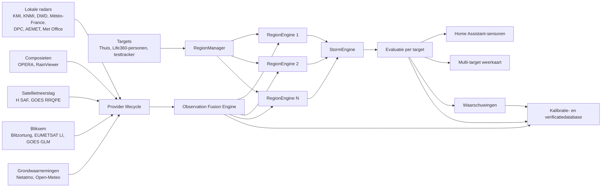

# Storm Tracker V3

## Van heterogene weerdata naar persoonsgebonden waarschuwingen

**Versie van de integratie bij opmaak:** 0.4.93
**Datum:** 23 juli 2026

## Samenvatting

Storm Tracker V3 is een geografisch gedistribueerd observatie-, fusie- en
nowcastingsysteem dat radarbeelden, satellietwaarnemingen, bliksemdata en
grondmetingen omzet in kortetermijnverwachtingen voor bewegende personen.

Het systeem probeert niet alleen te bepalen waar het regent, maar beantwoordt
een moeilijkere vraag:

> Hoe bepalen we met onvolledige, vertraagde en soms tegenstrijdige
> databronnen of neerslag of onweer een specifieke persoon of locatie zal
> bereiken?

Storm Tracker V3 is daarmee meer dan een weerkaart. Het is een experimenteel
beslissingsondersteunend systeem dat vier informatieniveaus van elkaar scheidt:

1. **Waarneming:** een radar, satelliet, bliksemnetwerk of weerstation meet iets.
2. **Meteorologisch object:** waarnemingen worden samengebracht tot een
   herkenbaar neerslaggebied of weersysteem.
3. **Voorspelling:** de beweging en mogelijke evolutie van dat weersysteem
   worden geprojecteerd.
4. **Beslissing:** voor iedere persoon wordt bepaald of het systeem hem
   waarschijnlijk zal raken, wanneer dat kan gebeuren en hoe onzeker die
   conclusie is.

Die scheiding voorkomt bijvoorbeeld dat één blikseminslag onmiddellijk als een
volledige onweersbui wordt geïnterpreteerd.

## 1. Systeemarchitectuur



De architectuur bestaat uit zes hoofdlagen:

1. targets en geografische regio's;
2. providerselectie en provider-lifecycle;
3. normalisering en observatiefusie;
4. detectie en opvolging van weersystemen;
5. beoordeling per persoon;
6. uitvoer en permanente verificatie.

## 2. Targets en RegionEngines

Een **target** is een locatie waarvoor het weer moet worden beoordeeld. De
integratie ondersteunt:

- `zone.home`;
- Life360-personen;
- de fictieve testtracker.

Targets worden niet noodzakelijk afzonderlijk verwerkt. Personen die
geografisch dicht bij elkaar zijn, kunnen één `RegionEngine` delen. Daardoor
hoeft dezelfde radar niet vijfmaal te worden opgehaald wanneer vijf gezinsleden
zich in dezelfde regio bevinden.

Wanneer iemand ver genoeg weg reist, ontstaat een nieuwe RegionEngine. Die
RegionEngine bevat:

- een geografisch centrum;
- een observatieradius;
- een eigen providerselectie;
- eigen radarhistoriek;
- eigen gedetecteerde weersystemen;
- eigen grondvalidatie;
- een eigen provider-lifecycle.

Wanneer niemand meer in een regio aanwezig is, kunnen de bijbehorende
providers gaan slapen. Buitenlandse bronnen hoeven daardoor niet permanent te
worden bevraagd.

De targets zijn in dit systeem dus daadwerkelijk de personen en locaties
waarvoor een voorspelling wordt gemaakt. Een radarcel of weersysteem is geen
target, maar een meteorologisch object dat ten opzichte van een target wordt
geëvalueerd.

## 3. Providerhiërarchie

De algemene bronregel is:

> Gebruik eerst de beste lokale officiële bron, daarna een Europees of
> wereldwijd radarcomposiet en pas daarna satellietdata.

| Niveau | Voorbeelden | Functie |
|---|---|---|
| Lokale officiële radar | KMI, KNMI, DWD, Météo-France, DPC Italië, AEMET, Met Office | Hoogste ruimtelijke betrouwbaarheid binnen het eigen dekkingsgebied |
| Continentaal composiet | OPERA | Europese radardekking samengesteld uit nationale radars |
| Wereldwijde aggregator | RainViewer | Operationele fallback waar lokale radar of OPERA ontbreekt |
| Satellietneerslag | H SAF H40B, GOES RRQPE | Aanvullen waar grondradar ontbreekt of onvoldoende dekking heeft |
| Bliksem | Blitzortung, EUMETSAT LI, GOES GLM | Elektrische activiteit; nooit rechtstreeks als neerslagradar |
| Grondvalidatie | Netatmo en nationale meetnetten | Controleren of radarwaarnemingen meteorologisch aannemelijk zijn |
| Modelbegeleiding | Open-Meteo (optioneel, standaard uit) | Context voor langere verwachtingen; nooit grondwaarheid of radar |

Voorbeelden van de geografische volgorde:

- België: KMI, daarna OPERA, RainViewer en H SAF;
- Nederland: KNMI, daarna OPERA, RainViewer en H SAF;
- Duitsland: DWD, daarna OPERA en RainViewer;
- Frankrijk: Météo-France, daarna OPERA, RainViewer en satelliet;
- Italië: DPC Radar, daarna OPERA of RainViewer en H SAF;
- Spanje: AEMET, daarna OPERA of RainViewer en satelliet;
- Griekenland: OPERA, daarna RainViewer en H SAF;
- Amerika: RainViewer en GOES RRQPE, met GOES GLM voor bliksem;
- buiten lokale dekking: RainViewer en beschikbare satellietproducten.

Een naam in het providerbeleid betekent niet automatisch dat er al een
volledige runtime-provider bestaat. Het beleidsbestand bevat ook voorziene of
toekomstige bronnen. NOAA MRMS is bijvoorbeeld architecturaal interessant,
maar moet nog als volwaardige operationele provider worden uitgebouwd.

## 4. Provider-lifecycle en foutafhandeling

Iedere RegionEngine activeert alleen providers die geografisch relevant zijn.
Een provider kan zich onder meer in de volgende toestanden bevinden:

- actief;
- slapend;
- tijdelijk in cooldown;
- niet geconfigureerd;
- buiten geografische dekking;
- tijdelijk defect.

Externe netwerkvragen krijgen harde time-outs. Een defecte of trage
buitenlandse API mag de volledige vijfminutencyclus niet blokkeren.

Na herhaalde fouten kan een circuit breaker de provider tijdelijk in cooldown
plaatsen. De RegionEngine gebruikt dan de volgende beschikbare bron in de
hiërarchie. Na de cooldown kan de primaire provider opnieuw voorzichtig worden
getest.

Een providerwissel wordt expliciet geregistreerd. Omdat verschillende bronnen
andere projecties, resoluties en gevoeligheden gebruiken, verlaagt een recente
bronwissel tijdelijk de voorspellingszekerheid. Radarpixels van incompatibele
grids worden niet blind numeriek gemiddeld.

## 5. De operationele cyclus

Iedere actieve RegionEngine doorloopt ongeveer iedere vijf minuten een
gecontroleerde cyclus:

1. bepalen welke lokale provider geografisch relevant is;
2. ophalen van de lokale radar;
3. ophalen van vergelijkings- en fallbackbronnen;
4. ophalen van bliksemwaarnemingen;
5. ophalen van grondvalidatie en luchtdrukgegevens;
6. normaliseren van alle gegevens;
7. fusie tot weersystemen;
8. berekenen van afstand, beweging, passage en ETA per target;
9. actualiseren van Home Assistant-sensoren en dashboard;
10. opslaan van waarnemingen en voorspellingen in de verificatiedatabase.

De fasen hebben afzonderlijke time-outs. Daardoor kan een trage provider worden
overgeslagen zonder dat andere RegionEngines hun volledige update missen.

## 6. Het uniforme observatiemodel

Elke provider levert technisch andere data:

- radarpixels;
- polygonen;
- regenintensiteit;
- bliksempunten;
- satellietproducten;
- stationsmetingen.

Daarom worden de gegevens eerst vertaald naar één gemeenschappelijk
observatiemodel. Een genormaliseerde observatie bevat onder meer:

- de bron;
- het observatietype;
- geografische coördinaten;
- de echte producttijd;
- intensiteit;
- kwaliteitsindicator;
- ruimtelijke footprint;
- systeem- of celidentificatie;
- de RegionEngine waarvoor de waarneming relevant is.

De rest van het systeem hoeft daardoor niet te weten hoe een specifiek KMI-,
DPC-, OPERA- of RainViewer-bestand technisch is opgebouwd.

De `Observation Fusion Engine` verzamelt deze observaties in batches, voert de
nodige controles uit en stuurt ze naar de juiste RegionEngine. Een observatie
wordt alleen naar een engine gestuurd wanneer haar geografische bereik die
engine werkelijk dekt.

## 7. Van radarpixels naar WeatherSystems

De moderne kaartlaag toont zo veel mogelijk de echte ruimtelijke radarpixels
van de provider. Dat is de visuele voorstelling.

Voor de analytische verwerking worden aaneengrenzende neerslagpixels gegroepeerd
tot samenhangende componenten. Daaruit kunnen worden afgeleid:

- de footprint van de neerslag;
- de dichtstbijzijnde rand;
- het geometrische zwaartepunt;
- de maximale of representatieve intensiteit;
- de oppervlakte;
- de oriëntatie;
- de overlap met een vorige waarneming.

De `StormEngine` probeert componenten uit opeenvolgende frames met elkaar te
verbinden. Het resultaat is een `WeatherSystem`.

Een WeatherSystem is een tijdsobject met:

- opeenvolgende posities;
- radarfootprints;
- intensiteitsverloop;
- bliksemactiviteit;
- levensfase;
- bewegingsmodel;
- onzekerheid.

Splitsende, samensmeltende, groeiende en uitdovende buien blijven complexe
gevallen. Daarom worden radarcellen niet uitsluitend op basis van hun
zwaartepunt gevolgd.

## 8. Afstand tot de bui

Voor waarschuwingen is de afstand tot het zwaartepunt meestal niet de
belangrijkste maat. Storm Tracker bewaart daarom verschillende afstanden:

- afstand tot de dichtstbijzijnde betrouwbare neerslagrand;
- afstand tot het zwaartepunt;
- afstand tot het best gevolgde weersysteem;
- afstand tot de geprojecteerde toekomstige footprint.

De operationele melding “bui op 20 km” hoort in de eerste plaats de afstand tot
de dichtstbijzijnde betrouwbare neerslagfootprint weer te geven. Een bui van
150 km lang kan met haar rand bijna boven een target liggen terwijl haar
zwaartepunt nog tientallen kilometers verder ligt.

Het dichtstbijzijnde neerslaggebied is niet noodzakelijk hetzelfde object als
het weersysteem waarvoor de betrouwbaarste baan kan worden berekend. Daarom
worden waargenomen afstand en voorspeld traject afzonderlijk bijgehouden.

## 9. Bewegingsschatting

De geografische coördinaten worden lokaal naar kilometers geprojecteerd:

```text
x ≈ Δlongitude × 111,32 × cos(latitude)
y ≈ Δlatitude  × 110,57
```

### 9.1 Lineair model

Het eenvoudigste bewegingsmodel is:

```text
p(t) = p0 + v × t
```

Hierbij wordt aangenomen dat richting en snelheid constant blijven.

### 9.2 Versnellingsmodel

Bij een gekromde of veranderende baan kan worden getest:

```text
p(t) = p0 + v0 × t + ½ × a × t²
```

Dit model wordt alleen aanvaard wanneer:

- voldoende opeenvolgende radarwaarnemingen bestaan;
- de historiek voldoende lang is;
- de berekende versnelling meteorologisch realistisch blijft;
- de toekomstige snelheid niet ontspoort;
- het model oudere waarnemingen aantoonbaar beter voorspelt dan het lineaire
  model.

Storm Tracker gebruikt daarvoor rolling hindcasts. Enkele recente
waarnemingen worden tijdelijk verborgen, waarna het model moet voorspellen waar
de bui werkelijk terechtkwam.

Het versnellingsmodel sluit aan bij bestaande stormtrackingmethoden, maar is
nog eenvoudiger dan volledige radar-nowcasting met optische stroming of
probabilistische ensembles.

Aanvullende academische achtergrond:

- [pySTEPS: probabilistische neerslagnowcasting](https://gmd.copernicus.org/articles/12/4185/2019/)
- [Stormtracking met een constant-acceleration Kalman-model](https://journals.ametsoc.org/view/journals/atot/26/3/2008jtecha1153_1.xml)

## 10. Voorspellen met de volledige footprint

Voor de 90-minutennowcast wordt niet alleen één punt vooruitgeschoven. De meest
recente werkelijke radarfootprint wordt minuut per minuut langs de verwachte
baan verplaatst.

Voor ieder toekomstig tijdstip wordt berekend:

- raakt de footprint het target?
- passeert alleen de rand?
- mist de bui het target?
- hoe groot is de minimale contourafstand?
- hoe groot is de onzekerheidsmarge?

Daaruit volgen:

- `raak`;
- `rand`;
- `mist`;
- ETA;
- tijdstip van dichtste passage;
- verwachte intensiteit;
- betrouwbaarheid.

Er zijn twee verschillende ETA-grondslagen:

- **radarcontour:** de geprojecteerde neerslagfootprint bereikt het target;
- **onzekerheidscorridor:** alleen de onzekerheidsmarge rond het traject bereikt
  het target.

Een ETA op basis van de onzekerheidscorridor is een voorzichtige mogelijkheid,
geen bevestigde aankomst.

## 11. Onzekerheid en betrouwbaarheid

Het aantal frames alleen bepaalt niet of een prognose betrouwbaar is. De score
houdt rekening met:

- aantal geldige observaties;
- duur van de historiek;
- geometrische fit;
- rolling-hindcastfout;
- stabiliteit van snelheid en richting;
- bronwisselingen;
- leeftijd van de data;
- passagegeometrie;
- radar- versus bliksemgrondslag;
- beschikbare grondvalidatie.

Een traject met tientallen frames kan nog steeds slecht voorspelbaar zijn
wanneer de cel:

- telkens splitst;
- snel groeit of uitdooft;
- voortdurend van gedetecteerde component verandert;
- aan de rand van de radardekking ligt;
- door verschillende providers anders wordt afgebeeld.

In zo'n geval hoort het systeem niet stil te vallen. Het moet een
conservatieve onzekerheidscorridor aanbieden en duidelijk melden dat de exacte
baan onzeker is.

De onzekerheidsmarge groeit met:

- de voorspellingshorizon;
- de gemeten hindcastfout;
- onregelmatige of versnellende beweging;
- recente bronwisselingen.

## 12. Luchtdruk en grondvalidatie

Netatmo wordt niet gebruikt als lokale barometer van de persoon. Het systeem
verzamelt stations rondom iedere RegionEngine.

De druktrend wordt pas geldig wanneer:

- voldoende historische meetpunten beschikbaar zijn;
- de tijdsreeks aaneengesloten is;
- meerdere vergelijkbare stations beschikbaar zijn;
- er geen grote tijdsgaten bestaan.

Een scherpe regionale drukdaling kan de meteorologische plausibiliteit van een
naderend systeem ondersteunen, maar veroorzaakt op zichzelf geen
regenwaarschuwing.

Na een Home Assistant-herstart blijft de druktrend daarom eerst `initializing`,
`unknown` of `onvoldoende_data`. Zo worden twee toevallige eerste waarden niet
als extreme drukval geïnterpreteerd.

Beschikbare nationale stationsbronnen worden als aanvullende validatie
gebruikt. Open-Meteo is uitsluitend optionele modelbegeleiding en staat
standaard uit. Wanneer het expliciet wordt ingeschakeld, vraagt één centrale
broker uitsluitend unieke targetlocaties op en bewaart per target zeven
kwartierstappen. Open-Meteo wordt nooit naar de radar-fusie gerouteerd,
geldt niet als grondwaarheid en vervangt een echte radar niet.

## 13. Bliksem

Bliksem wordt als een afzonderlijke observatielaag behandeld.

Primaire en aanvullende bronnen zijn:

- Blitzortung;
- EUMETSAT Lightning Imager;
- NOAA GOES GLM.

Bliksempunten kunnen worden geclusterd tot een bliksemgebied. Wanneer bliksem
ruimtelijk samenvalt met een radarfootprint, wordt die bui als elektrisch actief
beschouwd.

De rode knipperende zone op de kaart visualiseert actieve onweersactiviteit,
maar verandert de onderliggende neerslagpixels niet. Elektrische activiteit en
regenintensiteit zijn immers verschillende fysische variabelen.

Bliksem buiten gedetecteerde neerslag kan worden veroorzaakt door:

- bliksem aan het aambeeld van een onweerscel;
- radardrempels die lichte neerslag wegfilteren;
- tijdsverschil tussen radar- en bliksemframe;
- ontbrekende radarbedekking;
- locatie-onnauwkeurigheid.

Deze bliksem blijft zichtbaar en wordt niet kunstmatig in een neerslagfootprint
gedwongen.

## 14. Status per target

Voor ieder target wordt een eigen toestand berekend, bijvoorbeeld:

- droog;
- waargenomen;
- bevestigd;
- naderend;
- langs trekkend;
- wegtrekkend;
- alleen bliksem;
- onvoldoende gegevens.

Daarbij horen attributen zoals:

- stad en land;
- actieve radarbron;
- leeftijd en aantal frames;
- dichtstbijzijnde neerslagrand;
- maximale intensiteit;
- beweging;
- ETA;
- passageklasse;
- onzekerheidsmarge;
- betrouwbaarheid;
- luchtdruktrend;
- gebruikte RegionEngine.

Twee personen die thuis zijn, horen dezelfde meteorologische basisinformatie te
krijgen. Alleen de targetidentiteit verschilt. Wanneer dat niet gebeurt, wijst
dat op een fout in targetrouting, caching of RegionEngine-koppeling.

## 15. Waarschuwingen

Een waarschuwing wordt alleen verstuurd wanneer operationele voorwaarden zijn
vervuld:

- de status is naderend;
- de passage is `raak` of `rand`;
- de ETA ligt binnen de waarschuwingshorizon;
- de betrouwbaarheid is minimaal matig;
- het gebruikte traject is bruikbaar.

De huidige waarschuwingsfasen zijn conceptueel:

- vroege waarschuwing;
- nabij;
- imminent.

Updates kunnen volgen wanneer:

- de betrouwbaarheid van matig naar hoog stijgt;
- de intensiteit een hogere categorie bereikt;
- de ETA duidelijk korter wordt;
- de passage van rand naar raak verandert.

De notificatie gebruikt één onveranderlijke momentopname. Precies diezelfde
momentopname wordt in de database opgeslagen, zodat achteraf kan worden
onderzocht wat het systeem op dat moment wist.

Een bevestigde Home Assistant-notificatiedienst betekent dat Home Assistant het
bericht aan de mobiele dienst heeft overgedragen. Het bewijst niet dat het
bericht al door de gebruiker werd gezien.

## 16. Kalibratie- en verificatiedatabase

De SQLite-database is het wetenschappelijke geheugen van Storm Tracker.

Ze bewaart onder andere:

- providerframes;
- geografisch genormaliseerde rasterpunten;
- bron-tegen-bronvergelijkingen;
- droge waarnemingen;
- false positives en misses;
- precision, recall en F1-score;
- eigen verwachtingen;
- Buienradar-verificaties voor thuis;
- verstuurde waarschuwingen;
- targetpositie en RegionEngine;
- passage, ETA, afstand en betrouwbaarheid.

Voor twee bronnen geldt bijvoorbeeld:

```text
precision = TP / (TP + FP)
recall    = TP / (TP + FN)
F1        = 2 × precision × recall / (precision + recall)
```

Vergelijkingen gebeuren alleen wanneer observaties hetzelfde nominale tijdstip
vertegenwoordigen en beide providers minstens zestig procent van hetzelfde
RegionEngine-gebied werkelijk dekken. Provideractivatie op basis van een ruime
marge is dus niet langer hetzelfde als geldige kalibratiedekking.

De database observeert nog steeds de ruwe providerkwaliteit, maar gebruikt
vanaf schema v4 één beperkt en omkeerbaar resultaat operationeel:
bronwisselprofielen sturen uitsluitend de tijdelijke betrouwbaarheidsmarge.
Ze veranderen geen officiële pixels, intensiteiten of afstanden.

Een bronprofiel is richtingsgebonden. KMI naar OPERA is dus een ander profiel
dan OPERA naar KMI. Per geografische RegionEngine en als globale fallback
worden onder andere bijgehouden:

- welk aandeel van het natte gebied van de oude bron door de nieuwe bron
  wordt teruggevonden;
- hoeveel extra nat oppervlak de nieuwe bron tekent;
- de verhouding tussen beide natte oppervlakken;
- F1-score;
- intensiteitsverschil op overlappende rastercellen;
- kleine geografische rasterverschuiving;
- verschil in producttijd.

Vanaf twaalf bruikbare natte vergelijkingen mag het profiel de standaardmarge
van tien procentpunten gedurende tien minuten aanpassen. Goed gevulde,
sterk overeenkomende profielen verkorten de onzekerheidsperiode; een profiel
met slechte overeenkomst kan de confidence-straf vergroten. Zonder voldoende
historie blijft exact de veilige standaard actief.

Daarna kan worden onderzocht:

- welke provider neerslag het vaakst mist;
- welke bron structureel te groot tekent;
- welke ETA systematisch te vroeg of te laat is;
- hoe de kwaliteit per land, seizoen en intensiteit varieert;
- hoeveel waarschuwingen terecht waren;
- hoeveel echte buien zonder waarschuwing aankwamen.

De database bevindt zich in:

```text
.storage/storm_tracker_v3_calibration.sqlite3
```

Bij de overgang naar schema v4 wordt de pre-v4-dataset eenmalig verwijderd.
Die gegevens bevatten geen betrouwbare providerdekkingsgrenzen en kunnen dus
niet wetenschappelijk zuiver worden herberekend. Vanaf dat moment wordt per
beschikbaar target om de vijf minuten een eigen verificatiesnapshot op de
actuele GPS-positie opgeslagen; radarpixels blijven efficiënt per
RegionEngine gedeeld.

Ze gebruikt SQLite met WAL-transacties. Grote hoeveelheden historische data
worden op schijf opgeslagen en niet permanent in het werkgeheugen gehouden.

## 17. Home Assistant als runtime

Home Assistant levert:

- targets en Life360-posities;
- configuratie;
- sensoren;
- dashboards;
- notificatiediensten;
- eventafhandeling;
- persistentie en automatiseringen.

Rekenwerk en netwerk-I/O worden begrensd. Databasebewerkingen gebeuren in
batches buiten de centrale eventloop. Providerdata, trajecthistoriek en
weersystemen zijn eveneens begrensd, zodat de integratie niet onbeperkt RAM
verzamelt.

De NUC met 12 GB geheugen biedt voldoende ruimte voor het huidige
raster- en trajectmodel. Dat betekent niet dat onbeperkte radargrids of een
volledige pySTEPS-installatie zonder verdere architectuur veilig binnen Home
Assistant kunnen draaien. Zwaardere beeldverwerking hoort idealiter in een
afzonderlijk proces of een gespecialiseerde service.

## 18. Uitvoer

Storm Tracker V3 publiceert informatie via:

- Home Assistant-sensoren per target;
- technische provider- en RegionEngine-sensoren;
- de multi-target weerkaart;
- echte radarrasters;
- afstandsringen;
- bliksemsymbolen en bliksemclusters;
- neerslag- en onweersstatus;
- waarschuwingen;
- de kalibratiedatabasestatus.

De kaart is vooral een visuele controlelaag. De analytische berekeningen worden
niet uit de weergegeven schermpixels teruggelezen, maar uit de onderliggende
genormaliseerde observaties.

## 19. Wetenschappelijke positionering

Storm Tracker V3 bevindt zich tussen drie onderzoeksdomeinen:

1. **Sensorfusie:** combineren van bronnen met verschillende resolutie,
   vertraging en betrouwbaarheid.
2. **Object tracking:** herkennen en door de tijd volgen van meteorologische
   objecten.
3. **Decision support:** onzekerheid vertalen naar persoonsgebonden acties.

Sterke punten van de architectuur zijn:

- multi-target en mobiel;
- lokale provider eerst;
- expliciete fallbacks;
- echte neerslagfootprints;
- afzonderlijke bliksem- en regenlogica;
- onzekerheid als onderdeel van het resultaat;
- grootschalige verificatiedatabase;
- reproduceerbare waarschuwingen.

De voornaamste onderzoeksproblemen blijven:

- groei en uitdoving;
- splitsing en samensmelting;
- bronwisselingen;
- radarranden en blokkering;
- satellietvertraging;
- niet-lineaire beweging;
- betrouwbaar leren uit historiek zonder slechte automatische correcties.

## 20. Veiligheidspositie

Storm Tracker V3 is een experimenteel persoonlijk nowcasting- en
beslissingsondersteunend systeem. Het is geen gecertificeerd meteorologisch
waarschuwingssysteem.

Het systeem moet daarom:

- onzekerheid zichtbaar maken;
- ontbrekende data niet als droogte interpreteren;
- falende providers expliciet melden;
- conservatief omgaan met onzekere passages;
- verstuurde waarschuwingen reproduceerbaar opslaan.

Voor veiligheidskritische beslissingen blijven officiële waarschuwingen van
KMI, KNMI, Météo-France en andere nationale meteorologische diensten de
primaire autoriteit.

## Conclusie

Storm Tracker V3 probeert niet alleen te zeggen dat ergens regen ligt. Het
probeert te beantwoorden:

> Welk weersysteem zien we, welke bronnen ondersteunen dat, hoe evolueert het,
> welke persoon kan ermee geconfronteerd worden, wanneer gebeurt dat, hoe
> ernstig kan het zijn en hoeveel vertrouwen mogen we in die conclusie hebben?

Dat maakt de integratie technisch en wetenschappelijk veel uitgebreider dan een
klassieke Home Assistant-weerintegratie. De kern is niet één radarprovider,
maar de gecontroleerde combinatie van geografische providerselectie,
observatiefusie, weersysteemtracking, onzekerheidsmodellering, targetgerichte
evaluatie en permanente verificatie.
